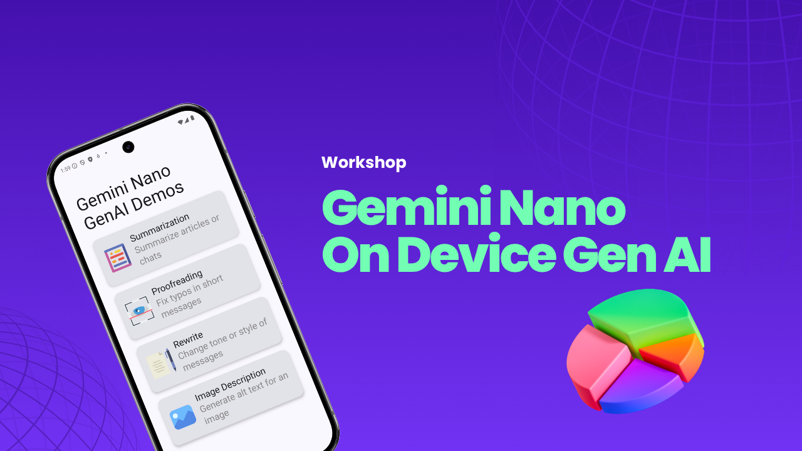

# Gemini Nano Workshop 🚀

Welcome to the hands-on workshop on building powerful **on-device GenAI Android apps** using *
*Gemini Nano** and **ML Kit GenAI APIs**.

This workshop is part of the live session:  
**_Gemini Nano: On-Device GenAI for the Next Generation of Android Apps_**  
📍 Cebu, Philippines

---

## 🔍 What You'll Learn

In this workshop, you'll explore how to:

- Use **Gemini Nano** to run GenAI features directly on Android devices
- Integrate **ML Kit GenAI APIs** into your app
- Build real-time features like:
    - ✍️ Text summarization
    - 🔁 Text rewriting in different tones
    - ✅ Proofreading user input
    - 🖼️ Image description using AI

Everything runs locally on-device. No cloud calls. No internet needed.

---

## 📁 Project Structure

This repository contains the following structure:

```
gemini-nano-workshop/
└── workshop/
    └── starter-project/
```

### 📂 `workshop/starter-project/`

This is the code you'll open in Android Studio to follow along during the session. It includes all the setup and boilerplate you need to get started quickly. You’ll implement GenAI features step by step with guidance.

---

## ⚙️ Requirements

Before you begin, make sure you have:

- ✅ Android Studio
- ✅ A real Android device that supports Gemini Nano  
  (e.g. Pixel 9, Galaxy S25, Xiaomi 15 Pro,
  etc.) [List of Supported Devices](https://developers.google.com/ml-kit/genai)
- ✅ Stable internet connection for initial setup (model downloads)
- ✅ Basic Kotlin and Android knowledge

---

## 🚀 How to Start

1. Clone this repo: `git clone https://github.com/probelalkhan/gemini-nano-workshop.git`
2. Open the starter project in Android Studio:
   `File → Open → gemini-nano-workshop/workshop/starter-project`
3. Let Gradle sync and build the project.
4. Connect your supported Android device and run the app.

Follow along with the workshop to build GenAI features step by step.

## 🙋‍♂️ About the Speaker

**Belal Khan**  
👨‍💻 Google Developer Expert for Android  
👔 Senior Software Engineer @ American Express  
🎤 Speaker at Google Developer Events  
📺 [YouTube — Simplified Coding](https://www.youtube.com/@SimplifiedCoding)

### Let's connect:

- 💼 [LinkedIn](https://www.linkedin.com/in/probelalkhan)
- 📺 [YouTube](https://www.youtube.com/@SimplifiedCoding)

## ❤️ Want to Dive Deeper?

After the workshop, feel free to:

- Extend the starter project with your own creative ideas
- Explore the AI Edge SDK
- Combine GenAI with other Android features like Compose, CameraX, or Voice

Thanks for joining the workshop!
Let’s build the future of Android — right on your device.